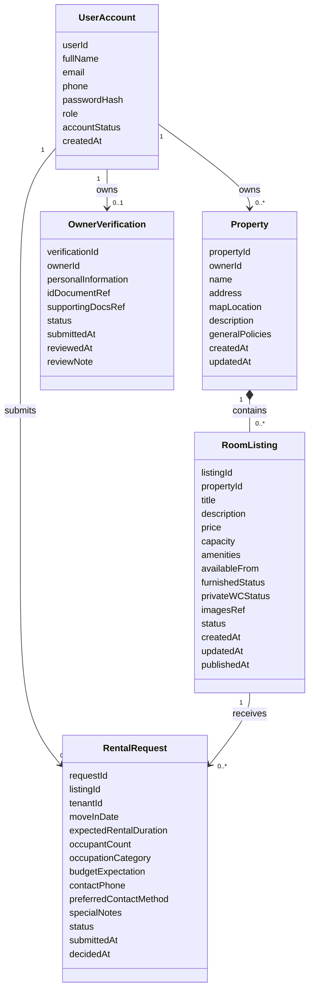

# Step 2.1: Class Diagram Blueprint - Hostel Management and Search System

## Classes

### Boundary Classes

| Class Name          | Stereotype             | Description                                                                                             |
| ------------------- | ---------------------- | ------------------------------------------------------------------------------------------------------- |
| `VisitorUI`         | `<<user interaction>>` | Interfaces with Visitor; search form, listing browse, registration entry                                |
| `TenantUI`          | `<<user interaction>>` | Interfaces with Tenant; rental request submission, cancellation, tracking                               |
| `OwnerUI`           | `<<user interaction>>` | Interfaces with Owner; property management, listing management, verification submission, request review |
| `AdminUI`           | `<<user interaction>>` | Interfaces with System Admin; verification review, account management, listing control                  |
| `AuthUI`            | `<<user interaction>>` | Shared sign-in interface for all Registered User subtypes                                               |
| `GoogleMapsProxy`   | `<<proxy>>`            | Interfaces with Google Maps; location data and map display                                              |
| `CloudStorageProxy` | `<<proxy>>`            | Interfaces with Cloud Storage; image upload and document retrieval                                      |
| `EmailProxy`        | `<<proxy>>`            | Interfaces with Email Provider; notification dispatch                                                   |

### Entity Classes

| Class Name          | Stereotype   | Attributes                                                                                                                                                                                                   |
| ------------------- | ------------ | ------------------------------------------------------------------------------------------------------------------------------------------------------------------------------------------------------------ |
| `UserAccount`       | `<<entity>>` | userId, fullName, email, phone, passwordHash, role, accountStatus, createdAt                                                                                                                                 |
| `Property`          | `<<entity>>` | propertyId, ownerId, name, address, mapLocation, description, generalPolicies, createdAt, updatedAt                                                                                                          |
| `RoomListing`       | `<<entity>>` | listingId, propertyId, title, description, price, capacity, amenities, availableFrom, furnishedStatus, privateWCStatus, imagesRef, status, createdAt, updatedAt, publishedAt                                 |
| `RentalRequest`     | `<<entity>>` | requestId, listingId, tenantId, moveInDate, expectedRentalDuration, occupantCount, occupationCategory, budgetExpectation, contactPhone, preferredContactMethod, specialNotes, status, submittedAt, decidedAt |
| `OwnerVerification` | `<<entity>>` | verificationId, ownerId, personalInformation, idDocumentRef, supportingDocsRef, status, submittedAt, reviewedAt, reviewNote                                                                                  |

> All entities have 2+ attributes. Single-attribute rule: satisfied.
>
> Naming rule for this blueprint:
>
> - Keep legacy entity names already used in communication diagrams whenever possible.
> - Enrich attributes and multiplicities instead of renaming entities unless Phase 1 forces a different concept.
> - `UserAccount` is used as the canonical account entity name because Phase 1 and the auth-related communication diagrams describe this concept as an account.
> - `OwnerVerification` is kept as the old class name and represents the current verification record of one owner.

### Control Classes

| Class Name                     | Stereotype        | Covers                                                             |
| ------------------------------ | ----------------- | ------------------------------------------------------------------ |
| `SearchCoordinator`            | `<<coordinator>>` | UC-01 Search Hostel Room                                           |
| `RoomDetailCoordinator`        | `<<coordinator>>` | UC-02 View Room Details                                            |
| `AuthCoordinator`              | `<<coordinator>>` | UC-03 Register Account, UC-04 Sign In                              |
| `RentalRequestCoordinator`     | `<<coordinator>>` | UC-05 Submit, UC-06 Cancel, UC-07 Track                            |
| `PropertyCoordinator`          | `<<coordinator>>` | UC-08a Create Property, UC-08b Update Property                     |
| `ListingManagementCoordinator` | `<<coordinator>>` | UC-09 Create, UC-10 Update, UC-11 Publish, UC-12 Change Visibility |
| `VerificationCoordinator`      | `<<coordinator>>` | UC-13 Submit Owner Verification, UC-16 Review Owner Verification   |
| `RequestReviewCoordinator`     | `<<coordinator>>` | UC-14 Review Rental Request, UC-15 Reopen Room Listing             |
| `AdminCoordinator`             | `<<coordinator>>` | UC-17 Manage Account, UC-18 Control Listing                        |

> All coordinators are stateless `<<coordinator>>`. State is captured directly in entity attributes such as `RoomListing.status`, `RentalRequest.status`, `OwnerVerification.status`, and `UserAccount.accountStatus`.

### Business Logic Classes

| Class Name            | Stereotype           | Owned Rules                                                                                                              |
| --------------------- | -------------------- | ------------------------------------------------------------------------------------------------------------------------ |
| `SearchMatchingLogic` | `<<business logic>>` | Multi-criteria filter matching for published listings                                                                    |
| `RoomListingLogic`    | `<<business logic>>` | Publication gate, listing status transitions, visibility and requestability rules                                        |
| `AuthenticationLogic` | `<<business logic>>` | Credential validation; `accountStatus = Active` required; role-based access policy                                       |
| `RentalRequestLogic`  | `<<business logic>>` | Requestability check; lifecycle (`Pending -> Accepted / Rejected / Cancelled by Tenant`, `Accepted -> Revoked by Owner`) |
| `VerificationLogic`   | `<<business logic>>` | Approve or reject owner verification; determine publishing eligibility                                                   |
| `UserManagementLogic` | `<<business logic>>` | Account status transition policy (`Active <-> Suspended -> Disabled`)                                                    |

### Service Classes

| Class Name            | Stereotype    | Capability                                      |
| --------------------- | ------------- | ----------------------------------------------- |
| `PropertyService`     | `<<service>>` | Property CRUD and required field validation     |
| `NotificationService` | `<<service>>` | Notification content composition per event type |

## Relationships

| From          | To                  | Type        | Multiplicity  | Description                                                                  |
| ------------- | ------------------- | ----------- | ------------- | ---------------------------------------------------------------------------- |
| `UserAccount` | `Property`          | Association | (1) - (0..\*) | Owner account creates and owns properties                                    |
| `Property`    | `RoomListing`       | Composition | (1) _- (0.._) | Property may exist before any listing; listing cannot exist without property |
| `UserAccount` | `RentalRequest`     | Association | (1) - (0..\*) | Tenant account submits rental requests                                       |
| `RoomListing` | `RentalRequest`     | Association | (1) - (0..\*) | Room listing receives rental requests from multiple tenants                  |
| `UserAccount` | `OwnerVerification` | Association | (1) - (0..1)  | Owner account has at most one current verification record                    |

## Entity Diagram Notes

- `RoomListing.status` uses business-visible states from Phase 1:
    - `Draft`, `Published Available`, `Locked`, `Hidden`, `Archived`
- Admin disable is represented as a forced visibility-control outcome on `RoomListing`, not as a separate renamed entity or extra status value.
- `OwnerVerification.status` uses:
    - `Pending Review`, `Verified`, `Rejected`
- `imagesRef`, `idDocumentRef`, and `supportingDocsRef` remain attributes to preserve the existing entity names used in communication diagrams.
- `UserAccount.role` distinguishes Tenant, Owner, and System Admin.

## Entity Class Diagram (Markdown)

## Interaction Patterns Detected

All 19 UCs follow **Pattern A: Client/Server**.

| Use Case                         | Pattern | Sequence                                                                                                                                 |
| -------------------------------- | ------- | ---------------------------------------------------------------------------------------------------------------------------------------- |
| UC-01 Search Hostel Room         | A       | `VisitorUI -> SearchCoordinator -> SearchMatchingLogic -> RoomListing (+GoogleMapsProxy)`                                                |
| UC-02 View Room Details          | A       | `VisitorUI -> RoomDetailCoordinator -> RoomListingLogic -> RoomListing, Property, UserAccount (+GoogleMapsProxy)`                        |
| UC-03 Register Account           | A       | `VisitorUI -> AuthCoordinator -> AuthenticationLogic -> UserAccount`                                                                     |
| UC-04 Sign In                    | A       | `AuthUI -> AuthCoordinator -> AuthenticationLogic -> UserAccount`                                                                        |
| UC-05 Submit Rental Request      | A       | `TenantUI -> RentalRequestCoordinator -> RentalRequestLogic -> RentalRequest (+EmailProxy via NotificationService)`                      |
| UC-06 Cancel Rental Request      | A       | `TenantUI -> RentalRequestCoordinator -> RentalRequestLogic -> RentalRequest (+EmailProxy via NotificationService)`                      |
| UC-07 Track Request Status       | A       | `TenantUI -> RentalRequestCoordinator -> RentalRequestLogic -> RentalRequest`                                                            |
| UC-08a Create Property           | A       | `OwnerUI -> PropertyCoordinator -> PropertyService -> Property`                                                                          |
| UC-08b Update Property           | A       | `OwnerUI -> PropertyCoordinator -> PropertyService -> Property`                                                                          |
| UC-09 Create Room Listing        | A       | `OwnerUI -> ListingManagementCoordinator -> RoomListingLogic -> RoomListing (+CloudStorageProxy)`                                        |
| UC-10 Update Room Listing        | A       | `OwnerUI -> ListingManagementCoordinator -> RoomListingLogic -> RoomListing (+CloudStorageProxy)`                                        |
| UC-11 Publish Room Listing       | A       | `OwnerUI -> ListingManagementCoordinator -> RoomListingLogic -> RoomListing (+VerificationLogic)`                                        |
| UC-12 Change Listing Visibility  | A       | `OwnerUI -> ListingManagementCoordinator -> RoomListingLogic -> RoomListing`                                                             |
| UC-13 Submit Owner Verification  | A       | `OwnerUI -> VerificationCoordinator -> VerificationLogic -> OwnerVerification (+CloudStorageProxy)`                                      |
| UC-14 Review Rental Request      | A       | `OwnerUI -> RequestReviewCoordinator -> RentalRequestLogic -> RentalRequest (+EmailProxy via NotificationService)`                       |
| UC-15 Reopen Room Listing        | A       | `OwnerUI -> RequestReviewCoordinator -> RentalRequestLogic -> RentalRequest, RoomListing (+EmailProxy via NotificationService)`          |
| UC-16 Review Owner Verification  | A       | `AdminUI -> VerificationCoordinator -> VerificationLogic -> OwnerVerification (+CloudStorageProxy, +EmailProxy via NotificationService)` |
| UC-17 Manage User Account        | A       | `AdminUI -> AdminCoordinator -> UserManagementLogic -> UserAccount (+EmailProxy via NotificationService)`                                |
| UC-18 Control Listing Visibility | A       | `AdminUI -> AdminCoordinator -> RoomListingLogic -> RoomListing (+EmailProxy via NotificationService)`                                   |

Use `/drawio` to generate a visual `.drawio` file from this blueprint.
