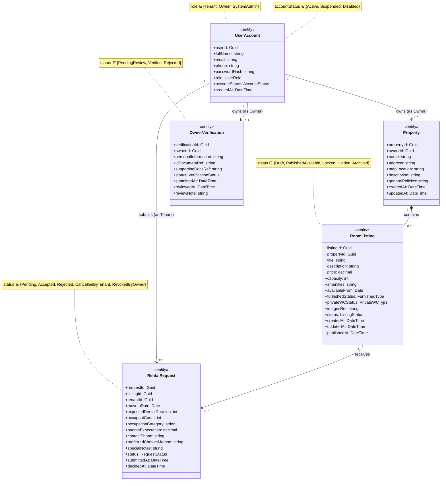

# Step 2.1: Static Entity Class Model - Hostel Management and Search System

> **COMET Methodology Reference**: This static model follows the five-step entity class gathering process:
> 1. Analyze domain concepts (nouns from use cases)
> 2. Define attributes and filter by data-intensity (2+ attributes rule)
> 3. Establish relationships and multiplicity
> 4. Refine with generalization/specialization
> 5. Formalize with <<entity>> stereotype

## Step 1: Domain Concept Analysis

The following core conceptual entities were identified from the problem domain:

| Domain Concept | Source Use Cases | Rationale as Entity |
| -------------- | ---------------- | ------------------- |
| **UserAccount** | UC-03, UC-04, UC-17 | Represents users (Tenant, Owner, System Admin) with persistent credentials and access control |
| **Property** | UC-08a, UC-08b, UC-02 | Represents physical hostel properties with location and policy information |
| **RoomListing** | UC-01, UC-02, UC-09-12, UC-15, UC-18 | Represents individual room offerings with pricing, amenities, and availability state |
| **RentalRequest** | UC-05, UC-06, UC-07, UC-14, UC-15 | Represents tenant rental proposals with decision workflow |
| **OwnerVerification** | UC-13, UC-16 | Represents owner identity verification submissions with admin review |

**Nouns Analyzed**: visitor, tenant, owner, system admin, account, property, room, listing, rental request, verification, document, image, notification, email, map, location.

**Filtered Out** (modeled as attributes, not entities):
- `amenities` → attribute in RoomListing (text/JSON field)
- `images` → attribute reference in RoomListing (handled via CloudStorageProxy)
- `notifications` → transient messages (no persistent entity needed)
- `location/map data` → attribute in Property (displayed via GoogleMapsProxy)

## Step 2: Attribute Definition and Validation

All entity classes satisfy the **data-intensive rule** (2+ attributes) and represent **persistent data** that survives system shutdown.

### Entity Classes

| Class Name | Stereotype | Attributes | Data-Intensity |
| ---------- | ---------- | ---------- | -------------- |
| `UserAccount` | `<<entity>>` | userId: Guid fullName: string email: string phone: string passwordHash: string role: UserRole accountStatus: AccountStatus createdAt: DateTime | ✅ 8 attributes |
| `Property` | `<<entity>>` | propertyId: Guid ownerId: Guid name: string address: string mapLocation: string description: string generalPolicies: string createdAt: DateTime updatedAt: DateTime | ✅ 9 attributes |
| `RoomListing` | `<<entity>>` | listingId: Guid propertyId: Guid title: string description: string price: decimal capacity: int amenities: string availableFrom: Date furnishedStatus: FurnishedType privateWCStatus: PrivateWCType imagesRef: string status: ListingStatus createdAt: DateTime updatedAt: DateTime publishedAt: DateTime | ✅ 15 attributes |
| `RentalRequest` | `<<entity>>` | requestId: Guid listingId: Guid tenantId: Guid moveInDate: Date expectedRentalDuration: int occupantCount: int occupationCategory: string budgetExpectation: decimal contactPhone: string preferredContactMethod: string specialNotes: string status: RequestStatus submittedAt: DateTime decidedAt: DateTime | ✅ 15 attributes |
| `OwnerVerification` | `<<entity>>` | verificationId: Guid ownerId: Guid personalInformation: string idDocumentRef: string supportingDocsRef: string status: VerificationStatus submittedAt: DateTime reviewedAt: DateTime reviewNote: string | ✅ 9 attributes |

**Attribute Type Definitions**:
- `UserRole`: Tenant | Owner | SystemAdmin
- `AccountStatus`: Active | Suspended | Disabled
- `ListingStatus`: Draft | PublishedAvailable | Locked | Hidden | Archived
- `RequestStatus`: Pending | Accepted | Rejected | CancelledByTenant | RevokedByOwner
- `VerificationStatus`: PendingReview | Verified | Rejected
- `FurnishedType`: FullyFurnished | PartiallyFurnished | Unfurnished
- `PrivateWCType`: Private | Shared | None

## Step 3: Relationships and Multiplicity

| From | To | Type | Multiplicity | Description |
| ---- | -- | ---- | ------------ | ----------- |
| `UserAccount` | `Property` | Association | (1) → (0..\*) | Owner account creates and owns properties |
| `Property` | `RoomListing` | Composition | (1) ♦→ (0.._) | Property may exist before any listing; listing cannot exist without property |
| `UserAccount` | `RentalRequest` | Association | (1) → (0..\*) | Tenant account submits rental requests |
| `RoomListing` | `RentalRequest` | Association | (1) → (0..\*) | Room listing receives rental requests from multiple tenants |
| `UserAccount` | `OwnerVerification` | Association | (1) → (0..1) | Owner account has at most one current verification record |

**Relationship Notes**:
- UserAccount.ownerId → Property (identifies property owner)
- Property.propertyId → RoomListing.propertyId (foreign key)
- UserAccount.userId → RentalRequest.tenantId (identifies tenant)
- RoomListing.listingId → RentalRequest.listingId (identifies requested room)
- UserAccount.userId → OwnerVerification.ownerId (identifies owner being verified)

## Step 4: Generalization and Specialization Analysis

**Considered but not applied**:
- UserAccount generalization (UserAccount as superclass, Tenant/Owner/Admin as subclasses)
  - **Decision**: Use single `UserAccount` entity with `role` attribute
  - **Rationale**: All user types share identical core attributes (userId, name, email, password, status). Role-based access control is simpler for Phase 2 analysis.

**No generalization hierarchies** are required in the current model. All entities are concrete specializations with no shared parent structure needed at this analysis level.

## Step 5: Formal Entity Class Model

### Stereotype Application

All persistent data classes are labeled with the `<<entity>>` stereotype to distinguish them from:
- `<<boundary>>` / `<<user interaction>>` classes (UI components)
- `<<control>>` / `<<coordinator>>` classes (orchestration logic)
- `<<proxy>>` classes (external system interfaces)

### Operation Deferral

Per COMET methodology, **operations are not defined** in this static entity model. Operations (methods like `create()`, `update()`, `validate()`, etc.) will be derived from dynamic behavior analysis in Phase 3 (Design Modeling).

### State Attributes

Each entity contains status/lifecycle attributes that capture state transitions:
- `UserAccount.accountStatus`: Active → Suspended → Disabled (UC-17)
- `RoomListing.status`: Draft → PublishedAvailable → Locked → Hidden → Archived (UC-09, UC-11, UC-12, UC-14, UC-15, UC-18)
- `RentalRequest.status`: Pending → Accepted/Rejected/CancelledByTenant, Accepted → RevokedByOwner (UC-05, UC-06, UC-14, UC-15)
- `OwnerVerification.status`: PendingReview → Verified/Rejected (UC-13, UC-16)

---

## Full Static Model (All Classes)

### Boundary Classes

| Class Name | Stereotype | Description |
| ---------- | ---------- | ----------- |
| `VisitorUI` | `<<user interaction>>` | Interfaces with Visitor; search form, listing browse, registration entry |
| `TenantUI` | `<<user interaction>>` | Interfaces with Tenant; rental request submission, cancellation, tracking |
| `OwnerUI` | `<<user interaction>>` | Interfaces with Owner; property management, listing management, verification submission, request review |
| `AdminUI` | `<<user interaction>>` | Interfaces with System Admin; verification review, account management, listing control |
| `AuthUI` | `<<user interaction>>` | Shared sign-in interface for all Registered User subtypes |
| `GoogleMapsProxy` | `<<proxy>>` | Interfaces with Google Maps; location data and map display |
| `CloudStorageProxy` | `<<proxy>>` | Interfaces with Cloud Storage; image upload and document retrieval |
| `EmailProxy` | `<<proxy>>` | Interfaces with Email Provider; notification dispatch |

### Control Classes

| Class Name | Stereotype | Covers |
| ---------- | ---------- | ------ |
| `SearchCoordinator` | `<<coordinator>>` | UC-01 Search Hostel Room |
| `RoomDetailCoordinator` | `<<coordinator>>` | UC-02 View Room Details |
| `AuthCoordinator` | `<<coordinator>>` | UC-03 Register Account, UC-04 Sign In |
| `RentalRequestCoordinator` | `<<coordinator>>` | UC-05 Submit, UC-06 Cancel, UC-07 Track |
| `PropertyCoordinator` | `<<coordinator>>` | UC-08a Create Property, UC-08b Update Property |
| `ListingManagementCoordinator` | `<<coordinator>>` | UC-09 Create, UC-10 Update, UC-11 Publish, UC-12 Change Visibility |
| `VerificationCoordinator` | `<<coordinator>>` | UC-13 Submit Owner Verification, UC-16 Review Owner Verification |
| `RequestReviewCoordinator` | `<<coordinator>>` | UC-14 Review Rental Request, UC-15 Reopen Room Listing |
| `AdminCoordinator` | `<<coordinator>>` | UC-17 Manage Account, UC-18 Control Listing |

### Business Logic Classes

| Class Name | Stereotype | Owned Rules |
| ---------- | ---------- | ----------- |
| `SearchMatchingLogic` | `<<business logic>>` | Multi-criteria filter matching for published listings |
| `RoomListingLogic` | `<<business logic>>` | Publication gate, listing status transitions, visibility and requestability rules |
| `AuthenticationLogic` | `<<business logic>>` | Credential validation; `accountStatus = Active` required; role-based access policy |
| `RentalRequestLogic` | `<<business logic>>` | Requestability check; lifecycle (`Pending -> Accepted / Rejected / Cancelled by Tenant`, `Accepted -> Revoked by Owner`) |
| `VerificationLogic` | `<<business logic>>` | Approve or reject owner verification; determine publishing eligibility |
| `UserManagementLogic` | `<<business logic>>` | Account status transition policy (`Active <-> Suspended -> Disabled`) |

### Service Classes

| Class Name | Stereotype | Capability |
| ---------- | ---------- | ---------- |
| `PropertyService` | `<<service>>` | Property CRUD and required field validation |
| `NotificationService` | `<<service>>` | Notification content composition per event type |

---

## Entity Diagram Notes

### Status Attributes (Lifecycle State)

| Entity | Status Attribute | Valid Values | State Transitions |
| ------ | ---------------- | ------------ | ----------------- |
| `UserAccount` | `accountStatus` | Active, Suspended, Disabled | Active ↔ Suspended → Disabled |
| `RoomListing` | `status` | Draft, PublishedAvailable, Locked, Hidden, Archived | Draft → PublishedAvailable → Locked → Archived; PublishedAvailable ↔ Hidden |
| `RentalRequest` | `status` | Pending, Accepted, Rejected, CancelledByTenant, RevokedByOwner | Pending → Accepted/Rejected/CancelledByTenant; Accepted → RevokedByOwner |
| `OwnerVerification` | `status` | PendingReview, Verified, Rejected | PendingReview → Verified/Rejected |

### Reference Attributes (External Storage)

- `imagesRef` in RoomListing: Stores cloud storage references for room images
- `idDocumentRef` in OwnerVerification: Stores cloud storage reference for ID document
- `supportingDocsRef` in OwnerVerification: Stores cloud storage references for supporting documents

These are **attribute references**, not separate entities. The actual file storage is handled by CloudStorageProxy.

### Role-Based Access Control

`UserAccount.role` distinguishes three actor types:
- **Tenant**: Can search rooms, submit/cancel/track rental requests
- **Owner**: Can manage properties and listings, submit verification, review requests
- **SystemAdmin**: Can review verifications, manage account statuses, control listing visibility

## Entity Class Diagram (Mermaid)

## Interaction Patterns Detected

All 18 UCs follow **Pattern A: Client/Server** (stateless web architecture).

| Use Case | Pattern | Primary Flow |
| -------- | ------- | ------------ |
| **UC-01 Search Hostel Room** | A | `VisitorUI → SearchCoordinator → SearchMatchingLogic → RoomListing (+GoogleMapsProxy)` |
| **UC-02 View Room Details** | A | `VisitorUI → RoomDetailCoordinator → RoomListingLogic → RoomListing, Property, UserAccount (+GoogleMapsProxy)` |
| **UC-03 Register Account** | A | `VisitorUI → AuthCoordinator → AuthenticationLogic → UserAccount` |
| **UC-04 Sign In** | A | `AuthUI → AuthCoordinator → AuthenticationLogic → UserAccount` |
| **UC-05 Submit Rental Request** | A | `TenantUI → RentalRequestCoordinator → RentalRequestLogic → RentalRequest (+EmailProxy)` |
| **UC-06 Cancel Rental Request** | A | `TenantUI → RentalRequestCoordinator → RentalRequestLogic → RentalRequest (+EmailProxy)` |
| **UC-07 Track Request Status** | A | `TenantUI → RentalRequestCoordinator → RentalRequestLogic → RentalRequest` |
| **UC-08a Create Property** | A | `OwnerUI → PropertyCoordinator → PropertyService → Property` |
| **UC-08b Update Property** | A | `OwnerUI → PropertyCoordinator → PropertyService → Property` |
| **UC-09 Create Room Listing** | A | `OwnerUI → ListingManagementCoordinator → RoomListingLogic → RoomListing (+CloudStorageProxy)` |
| **UC-10 Update Room Listing** | A | `OwnerUI → ListingManagementCoordinator → RoomListingLogic → RoomListing (+CloudStorageProxy)` |
| **UC-11 Publish Room Listing** | A | `OwnerUI → ListingManagementCoordinator → RoomListingLogic → RoomListing (+VerificationLogic)` |
| **UC-12 Change Listing Visibility** | A | `OwnerUI → ListingManagementCoordinator → RoomListingLogic → RoomListing` |
| **UC-13 Submit Owner Verification** | A | `OwnerUI → VerificationCoordinator → VerificationLogic → OwnerVerification (+CloudStorageProxy)` |
| **UC-14 Review Rental Request** | A | `OwnerUI → RequestReviewCoordinator → RentalRequestLogic → RentalRequest, RoomListing (+EmailProxy)` |
| **UC-15 Reopen Room Listing** | A | `OwnerUI → RequestReviewCoordinator → RentalRequestLogic → RentalRequest, RoomListing (+EmailProxy)` |
| **UC-16 Review Owner Verification** | A | `AdminUI → VerificationCoordinator → VerificationLogic → OwnerVerification (+CloudStorageProxy, +EmailProxy)` |
| **UC-17 Manage User Account** | A | `AdminUI → AdminCoordinator → UserManagementLogic → UserAccount (+EmailProxy)` |
| **UC-18 Control Listing Visibility** | A | `AdminUI → AdminCoordinator → RoomListingLogic → RoomListing (+EmailProxy)` |

### Key Entity Access Patterns by Actor Role

| Actor Role | Entity Read Operations | Entity Write Operations |
| ---------- | ---------------------- | ----------------------- |
| **Visitor** | RoomListing (search), Property (view details) | UserAccount (register) |
| **Tenant** | RoomListing (browse), RentalRequest (track) | RentalRequest (submit, cancel) |
| **Owner** | Property (own), RoomListing (manage), RentalRequest (review), OwnerVerification (submit) | Property (create, update), RoomListing (CRUD, publish), RentalRequest (accept, reject, revoke) |
| **System Admin** | OwnerVerification (review), UserAccount (view) | OwnerVerification (approve, reject), UserAccount (suspend, disable), RoomListing (hide, archive) |

### State Transition Patterns

| Entity | Trigger Use Cases | State Changes |
| ------ | ----------------- | ------------- |
| **UserAccount** | UC-03, UC-17 | Created (Active) → Suspended/Disabled |
| **RoomListing** | UC-09, UC-11, UC-12, UC-14, UC-15, UC-18 | Draft → PublishedAvailable → Locked → Archived |
| **RentalRequest** | UC-05, UC-06, UC-14, UC-15 | Pending → Accepted/Rejected/Cancelled; Accepted → Revoked |
| **OwnerVerification** | UC-13, UC-16 | PendingReview → Verified/Rejected |

---

## Relational Database Mapping Preview

The following table structure can be derived from this static model for Phase 4 implementation:

| Table Name | Primary Key | Foreign Keys | Indexes |
| ---------- | ----------- | ------------ | ------- |
| `UserAccounts` | `userId` | — | `email` (unique), `role`, `accountStatus` |
| `Properties` | `propertyId` | `ownerId` → UserAccounts(userId) | `ownerId` |
| `RoomListings` | `listingId` | `propertyId` → Properties(propertyId) | `propertyId`, `status`, `price` |
| `RentalRequests` | `requestId` | `listingId` → RoomListings(listingId), `tenantId` → UserAccounts(userId) | `listingId`, `tenantId`, `status`, `submittedAt` |
| `OwnerVerifications` | `verificationId` | `ownerId` → UserAccounts(userId) | `ownerId`, `status`, `submittedAt` |

**Notes for Phase 4**:
- All relationships are implemented as foreign key constraints
- Composite indexes on frequently filtered columns (status, dates)
- Cascade delete rules: Property deletion cascades to RoomListing; UserAccount deletion cascades to dependent records based on business rules
