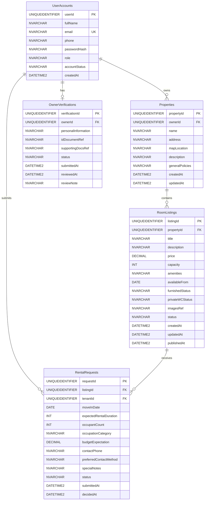

# Step 2.3: Relational Database Schema - Hostel Management and Search System

> **COMET Methodology Reference**: This schema translates the static entity class model (Step 2.1) into a physical relational database design following the seven-step mapping process.

---

## Step 1: Map Entity Classes to Relational Tables

Every `<<entity>>` class from the static model becomes a relational table with the same name.

| Entity Class | Relational Table | Row Meaning |
| ------------ | ---------------- | ----------- |
| `UserAccount` | `UserAccounts` | One registered user (Tenant/Owner/Admin) |
| `Property` | `Properties` | One hostel property |
| `RoomListing` | `RoomListings` | One room offering under a property |
| `RentalRequest` | `RentalRequests` | One rental request from a tenant |
| `OwnerVerification` | `OwnerVerifications` | One verification submission from an owner |

**Column Mapping**: Each attribute becomes a column with the same name and compatible data type.

---

## Step 2: Identify Primary Keys

All tables use **single-attribute surrogate keys** (GUID/UUID) for guaranteed uniqueness and distributed system compatibility.

| Table | Primary Key | Data Type | Rationale |
| ----- | ----------- | --------- | --------- |
| `UserAccounts` | `userId` | `UNIQUEIDENTIFIER` (GUID) | Globally unique across all user types |
| `Properties` | `propertyId` | `UNIQUEIDENTIFIER` (GUID) | Unique property identifier |
| `RoomListings` | `listingId` | `UNIQUEIDENTIFIER` (GUID) | Unique listing identifier |
| `RentalRequests` | `requestId` | `UNIQUEIDENTIFIER` (GUID) | Unique request identifier |
| `OwnerVerifications` | `verificationId` | `UNIQUEIDENTIFIER` (GUID) | Unique verification record |

**Note**: Natural keys (e.g., email) are NOT used as primary keys to allow for email changes while preserving historical data integrity.

---

## Step 3: Map Associations to Foreign Keys

All associations from the static model become foreign key constraints. The foreign key is always placed on the "many" side or the "dependent" side of the relationship.

| Association (From → To) | Multiplicity | Foreign Key Placement | Column Name |
| ----------------------- | ------------ | --------------------- | ----------- |
| `UserAccount` → `Property` | 1 → 0..\* | In `Properties` table | `ownerId` |
| `Property` → `RoomListing` | 1 ♦→ 0.._ (Composition) | In `RoomListings` table | `propertyId` |
| `UserAccount` → `RentalRequest` | 1 → 0..\* | In `RentalRequests` table | `tenantId` |
| `RoomListing` → `RentalRequest` | 1 → 0..\* | In `RentalRequests` table | `listingId` |
| `UserAccount` → `OwnerVerification` | 1 → 0..1 | In `OwnerVerifications` table | `ownerId` |

**Foreign Key Constraint Definitions**:
```sql
-- Properties.ownerId → UserAccounts.userId
ALTER TABLE Properties
ADD CONSTRAINT FK_Properties_UserAccounts
FOREIGN KEY (ownerId) REFERENCES UserAccounts(userId)
ON DELETE NO ACTION ON UPDATE CASCADE;

-- RoomListings.propertyId → Properties.propertyId
ALTER TABLE RoomListings
ADD CONSTRAINT FK_RoomListings_Properties
FOREIGN KEY (propertyId) REFERENCES Properties(propertyId)
ON DELETE CASCADE ON UPDATE CASCADE;

-- RentalRequests.tenantId → UserAccounts.userId
ALTER TABLE RentalRequests
ADD CONSTRAINT FK_RentalRequests_Tenant
FOREIGN KEY (tenantId) REFERENCES UserAccounts(userId)
ON DELETE NO ACTION ON UPDATE CASCADE;

-- RentalRequests.listingId → RoomListings.listingId
ALTER TABLE RentalRequests
ADD CONSTRAINT FK_RentalRequests_RoomListings
FOREIGN KEY (listingId) REFERENCES RoomListings(listingId)
ON DELETE NO ACTION ON UPDATE CASCADE;

-- OwnerVerifications.ownerId → UserAccounts.userId
ALTER TABLE OwnerVerifications
ADD CONSTRAINT FK_OwnerVerifications_UserAccounts
FOREIGN KEY (ownerId) REFERENCES UserAccounts(userId)
ON DELETE CASCADE ON UPDATE CASCADE;
```

---

## Step 4: Map Association Classes to Association Tables

**None Required**: The HMSS domain has no many-to-many relationships requiring association tables. All relationships are one-to-many.

---

## Step 5: Map Whole/Part (Aggregation/Composition) Relationships

### Composition: Property → RoomListing

| Relationship Type | Whole | Part | Foreign Key Placement |
| ----------------- | ----- | ---- | --------------------- |
| Composition | `Property` | `RoomListing` | `propertyId` in RoomListings |

**Cascade Delete Rule**: When a Property is deleted, all associated RoomListings are also deleted (`ON DELETE CASCADE`). This is correct because a RoomListing cannot exist without its parent Property.

### No Other Whole/Part Relationships

- UserAccount → Property: Association (Property can exist independently if transferred)
- UserAccount → RentalRequest: Association (Request persists even if account is disabled)
- RoomListing → RentalRequest: Association (Requests are historical records)

---

## Step 6: Map Generalization/Specialization (Inheritance) Relationships

### UserAccount Specialization Analysis

**Considered**: UserAccount with Tenant, Owner, SystemAdmin subclasses.

**Decision**: **Option C - Map Superclass Only**

**Rationale**:
1. All user types share identical core attributes (userId, fullName, email, phone, passwordHash, accountStatus, createdAt)
2. Only one attribute differs: `role` (enum: Tenant, Owner, SystemAdmin)
3. No type-specific methods or attributes exist in Phase 2
4. Performance: Single table avoids JOIN operations for every user lookup
5. Simplicity: Role-based access control is enforced via `role` attribute and business logic layer

**Implementation**: Single `UserAccounts` table with `role` discriminator column.

| Table | Discriminator Column | Valid Values |
| ----- | -------------------- | ------------ |
| `UserAccounts` | `role` | `Tenant`, `Owner`, `SystemAdmin` |

**No inheritance tables** required for other entities (Property, RoomListing, RentalRequest, OwnerVerification).

---

## Step 7: Encapsulate with Database Wrapper Classes

Each table is accessed through a Repository interface that hides raw SQL and provides object-oriented operations.

| Table | Repository Interface | Key Operations |
| ----- | -------------------- | -------------- |
| `UserAccounts` | `IUserAccountRepository` | `save()`, `findById()`, `findByEmail()`, `update()`, `delete()` |
| `Properties` | `IPropertyRepository` | `save()`, `findById()`, `findByOwner()`, `update()`, `delete()` |
| `RoomListings` | `IRoomListingRepository` | `save()`, `findById()`, `findByProperty()`, `findByStatus()`, `update()`, `delete()` |
| `RentalRequests` | `IRentalRequestRepository` | `save()`, `findById()`, `findByTenant()`, `findByListing()`, `update()`, `delete()` |
| `OwnerVerifications` | `IOwnerVerificationRepository` | `save()`, `findById()`, `findByOwner()`, `update()`, `delete()` |

**Repository Pattern Benefits**:
- Hides SQL complexity from business logic layer
- Enables easy database provider switching (SQL Server, PostgreSQL, etc.)
- Supports unit testing with mock implementations
- Centralizes query optimization and indexing strategy

---

## Complete Database Schema

### Table: UserAccounts

| Column Name | Data Type | Constraints | Description |
| ----------- | --------- | ----------- | ----------- |
| `userId` | `UNIQUEIDENTIFIER` | PRIMARY KEY | Unique user identifier |
| `fullName` | `NVARCHAR(100)` | NOT NULL | User's full name |
| `email` | `NVARCHAR(255)` | NOT NULL, UNIQUE | Email address (login) |
| `phone` | `NVARCHAR(20)` | NOT NULL | Contact phone number |
| `passwordHash` | `NVARCHAR(255)` | NOT NULL | Hashed password (non-reversible) |
| `role` | `NVARCHAR(20)` | NOT NULL | Tenant | Owner | SystemAdmin |
| `accountStatus` | `NVARCHAR(20)` | NOT NULL | Active | Suspended | Disabled |
| `createdAt` | `DATETIME2` | NOT NULL, DEFAULT GETDATE() | Account creation timestamp |

**Indexes**:
- `IX_UserAccounts_email` ON `email` (UNIQUE)
- `IX_UserAccounts_role` ON `role`
- `IX_UserAccounts_accountStatus` ON `accountStatus`

---

### Table: Properties

| Column Name | Data Type | Constraints | Description |
| ----------- | --------- | ----------- | ----------- |
| `propertyId` | `UNIQUEIDENTIFIER` | PRIMARY KEY | Unique property identifier |
| `ownerId` | `UNIQUEIDENTIFIER` | NOT NULL, FK → UserAccounts.userId | Property owner |
| `name` | `NVARCHAR(100)` | NOT NULL | Property display name |
| `address` | `NVARCHAR(255)` | NOT NULL | Street address |
| `mapLocation` | `NVARCHAR(100)` | NULL | Google Maps location reference |
| `description` | `NVARCHAR(MAX)` | NULL | Property description |
| `generalPolicies` | `NVARCHAR(MAX)` | NULL | House rules and policies |
| `createdAt` | `DATETIME2` | NOT NULL, DEFAULT GETDATE() | Creation timestamp |
| `updatedAt` | `DATETIME2` | NOT NULL, DEFAULT GETDATE() | Last update timestamp |

**Indexes**:
- `IX_Properties_ownerId` ON `ownerId`
- `IX_Properties_name` ON `name`

---

### Table: RoomListings

| Column Name | Data Type | Constraints | Description |
| ----------- | --------- | ----------- | ----------- |
| `listingId` | `UNIQUEIDENTIFIER` | PRIMARY KEY | Unique listing identifier |
| `propertyId` | `UNIQUEIDENTIFIER` | NOT NULL, FK → Properties.propertyId | Parent property |
| `title` | `NVARCHAR(100)` | NOT NULL | Listing headline |
| `description` | `NVARCHAR(MAX)` | NULL | Detailed room description |
| `price` | `DECIMAL(10,2)` | NOT NULL | Monthly rental price |
| `capacity` | `INT` | NOT NULL | Maximum occupants |
| `amenities` | `NVARCHAR(MAX)` | NULL | Amenity list (JSON/text) |
| `availableFrom` | `DATE` | NOT NULL | Availability start date |
| `furnishedStatus` | `NVARCHAR(20)` | NOT NULL | FullyFurnished \| PartiallyFurnished \| Unfurnished |
| `privateWCStatus` | `NVARCHAR(20)` | NOT NULL | Private \| Shared \| None |
| `imagesRef` | `NVARCHAR(MAX)` | NULL | Cloud storage image references |
| `status` | `NVARCHAR(30)` | NOT NULL | Draft \| PublishedAvailable \| Locked \| Hidden \| Archived |
| `createdAt` | `DATETIME2` | NOT NULL, DEFAULT GETDATE() | Creation timestamp |
| `updatedAt` | `DATETIME2` | NOT NULL, DEFAULT GETDATE() | Last update timestamp |
| `publishedAt` | `DATETIME2` | NULL | Publication timestamp |

**Indexes**:
- `IX_RoomListings_propertyId` ON `propertyId`
- `IX_RoomListings_status` ON `status`
- `IX_RoomListings_price` ON `price`
- `IX_RoomListings_availableFrom` ON `availableFrom`

---

### Table: RentalRequests

| Column Name | Data Type | Constraints | Description |
| ----------- | --------- | ----------- | ----------- |
| `requestId` | `UNIQUEIDENTIFIER` | PRIMARY KEY | Unique request identifier |
| `listingId` | `UNIQUEIDENTIFIER` | NOT NULL, FK → RoomListings.listingId | Requested room |
| `tenantId` | `UNIQUEIDENTIFIER` | NOT NULL, FK → UserAccounts.userId | Tenant who submitted |
| `moveInDate` | `DATE` | NOT NULL | Desired move-in date |
| `expectedRentalDuration` | `INT` | NOT NULL | Duration in months |
| `occupantCount` | `INT` | NOT NULL | Number of occupants |
| `occupationCategory` | `NVARCHAR(50)` | NULL | Student \| Working Professional |
| `budgetExpectation` | `DECIMAL(10,2)` | NULL | Tenant's budget range |
| `contactPhone` | `NVARCHAR(20)` | NOT NULL | Contact number |
| `preferredContactMethod` | `NVARCHAR(20)` | NOT NULL | Phone \| Email \| WhatsApp |
| `specialNotes` | `NVARCHAR(MAX)` | NULL | Additional requests |
| `status` | `NVARCHAR(30)` | NOT NULL | Pending \| Accepted \| Rejected \| CancelledByTenant \| RevokedByOwner |
| `submittedAt` | `DATETIME2` | NOT NULL, DEFAULT GETDATE() | Submission timestamp |
| `decidedAt` | `DATETIME2` | NULL | Decision timestamp |

**Indexes**:
- `IX_RentalRequests_listingId` ON `listingId`
- `IX_RentalRequests_tenantId` ON `tenantId`
- `IX_RentalRequests_status` ON `status`
- `IX_RentalRequests_submittedAt` ON `submittedAt`

---

### Table: OwnerVerifications

| Column Name | Data Type | Constraints | Description |
| ----------- | --------- | ----------- | ----------- |
| `verificationId` | `UNIQUEIDENTIFIER` | PRIMARY KEY | Unique verification record |
| `ownerId` | `UNIQUEIDENTIFIER` | NOT NULL, FK → UserAccounts.userId | Owner being verified |
| `personalInformation` | `NVARCHAR(MAX)` | NULL | Personal details (encrypted) |
| `idDocumentRef` | `NVARCHAR(500)` | NOT NULL | Cloud storage ID document reference |
| `supportingDocsRef` | `NVARCHAR(MAX)` | NULL | Cloud storage supporting documents |
| `status` | `NVARCHAR(20)` | NOT NULL | PendingReview \| Verified \| Rejected |
| `submittedAt` | `DATETIME2` | NOT NULL, DEFAULT GETDATE() | Submission timestamp |
| `reviewedAt` | `DATETIME2` | NULL | Admin review timestamp |
| `reviewNote` | `NVARCHAR(MAX)` | NULL | Admin rejection/approval notes |

**Indexes**:
- `IX_OwnerVerifications_ownerId` ON `ownerId`
- `IX_OwnerVerifications_status` ON `status`
- `IX_OwnerVerifications_submittedAt` ON `submittedAt`

---

## Entity-Relationship Diagram (SQL Dialect)



---

## SQL Server CREATE TABLE Script

```sql
-- =============================================
-- HMSS Database Schema Creation Script
-- SQL Server / Azure SQL Syntax
-- =============================================

-- UserAccounts Table
CREATE TABLE UserAccounts (
    userId              UNIQUEIDENTIFIER DEFAULT NEWID() NOT NULL,
    fullName            NVARCHAR(100)     NOT NULL,
    email               NVARCHAR(255)     NOT NULL,
    phone               NVARCHAR(20)      NOT NULL,
    passwordHash        NVARCHAR(255)     NOT NULL,
    role                NVARCHAR(20)      NOT NULL CHECK (role IN ('Tenant', 'Owner', 'SystemAdmin')),
    accountStatus       NVARCHAR(20)      NOT NULL CHECK (accountStatus IN ('Active', 'Suspended', 'Disabled')),
    createdAt           DATETIME2         DEFAULT GETDATE() NOT NULL,
    CONSTRAINT PK_UserAccounts PRIMARY KEY (userId),
    CONSTRAINT UQ_UserAccounts_email UNIQUE (email)
);

-- Properties Table
CREATE TABLE Properties (
    propertyId          UNIQUEIDENTIFIER DEFAULT NEWID() NOT NULL,
    ownerId             UNIQUEIDENTIFIER NOT NULL,
    name                NVARCHAR(100)     NOT NULL,
    address             NVARCHAR(255)     NOT NULL,
    mapLocation         NVARCHAR(100)     NULL,
    description         NVARCHAR(MAX)     NULL,
    generalPolicies     NVARCHAR(MAX)     NULL,
    createdAt           DATETIME2         DEFAULT GETDATE() NOT NULL,
    updatedAt           DATETIME2         DEFAULT GETDATE() NOT NULL,
    CONSTRAINT PK_Properties PRIMARY KEY (propertyId),
    CONSTRAINT FK_Properties_UserAccounts FOREIGN KEY (ownerId)
        REFERENCES UserAccounts(userId)
);

-- RoomListings Table
CREATE TABLE RoomListings (
    listingId           UNIQUEIDENTIFIER DEFAULT NEWID() NOT NULL,
    propertyId          UNIQUEIDENTIFIER NOT NULL,
    title               NVARCHAR(100)     NOT NULL,
    description         NVARCHAR(MAX)     NULL,
    price               DECIMAL(10,2)     NOT NULL,
    capacity            INT               NOT NULL,
    amenities           NVARCHAR(MAX)     NULL,
    availableFrom       DATE              NOT NULL,
    furnishedStatus     NVARCHAR(20)      NOT NULL CHECK (furnishedStatus IN ('FullyFurnished', 'PartiallyFurnished', 'Unfurnished')),
    privateWCStatus     NVARCHAR(20)      NOT NULL CHECK (privateWCStatus IN ('Private', 'Shared', 'None')),
    imagesRef           NVARCHAR(MAX)     NULL,
    status              NVARCHAR(30)      NOT NULL CHECK (status IN ('Draft', 'PublishedAvailable', 'Locked', 'Hidden', 'Archived')),
    createdAt           DATETIME2         DEFAULT GETDATE() NOT NULL,
    updatedAt           DATETIME2         DEFAULT GETDATE() NOT NULL,
    publishedAt         DATETIME2         NULL,
    CONSTRAINT PK_RoomListings PRIMARY KEY (listingId),
    CONSTRAINT FK_RoomListings_Properties FOREIGN KEY (propertyId)
        REFERENCES Properties(propertyId) ON DELETE CASCADE
);

-- RentalRequests Table
CREATE TABLE RentalRequests (
    requestId               UNIQUEIDENTIFIER DEFAULT NEWID() NOT NULL,
    listingId               UNIQUEIDENTIFIER NOT NULL,
    tenantId                UNIQUEIDENTIFIER NOT NULL,
    moveInDate              DATE              NOT NULL,
    expectedRentalDuration  INT               NOT NULL,
    occupantCount           INT               NOT NULL,
    occupationCategory      NVARCHAR(50)      NULL,
    budgetExpectation       DECIMAL(10,2)     NULL,
    contactPhone            NVARCHAR(20)      NOT NULL,
    preferredContactMethod  NVARCHAR(20)      NOT NULL,
    specialNotes            NVARCHAR(MAX)     NULL,
    status                  NVARCHAR(30)      NOT NULL CHECK (status IN ('Pending', 'Accepted', 'Rejected', 'CancelledByTenant', 'RevokedByOwner')),
    submittedAt             DATETIME2         DEFAULT GETDATE() NOT NULL,
    decidedAt               DATETIME2         NULL,
    CONSTRAINT PK_RentalRequests PRIMARY KEY (requestId),
    CONSTRAINT FK_RentalRequests_RoomListings FOREIGN KEY (listingId)
        REFERENCES RoomListings(listingId),
    CONSTRAINT FK_RentalRequests_Tenant FOREIGN KEY (tenantId)
        REFERENCES UserAccounts(userId)
);

-- OwnerVerifications Table
CREATE TABLE OwnerVerifications (
    verificationId        UNIQUEIDENTIFIER DEFAULT NEWID() NOT NULL,
    ownerId               UNIQUEIDENTIFIER NOT NULL,
    personalInformation   NVARCHAR(MAX)     NULL,
    idDocumentRef         NVARCHAR(500)     NOT NULL,
    supportingDocsRef     NVARCHAR(MAX)     NULL,
    status                NVARCHAR(20)      NOT NULL CHECK (status IN ('PendingReview', 'Verified', 'Rejected')),
    submittedAt           DATETIME2         DEFAULT GETDATE() NOT NULL,
    reviewedAt            DATETIME2         NULL,
    reviewNote            NVARCHAR(MAX)     NULL,
    CONSTRAINT PK_OwnerVerifications PRIMARY KEY (verificationId),
    CONSTRAINT FK_OwnerVerifications_UserAccounts FOREIGN KEY (ownerId)
        REFERENCES UserAccounts(userId) ON DELETE CASCADE
);

-- =============================================
-- Indexes for Performance
-- =============================================

-- UserAccounts Indexes
CREATE UNIQUE INDEX IX_UserAccounts_email ON UserAccounts(email);
CREATE INDEX IX_UserAccounts_role ON UserAccounts(role);
CREATE INDEX IX_UserAccounts_accountStatus ON UserAccounts(accountStatus);

-- Properties Indexes
CREATE INDEX IX_Properties_ownerId ON Properties(ownerId);
CREATE INDEX IX_Properties_name ON Properties(name);

-- RoomListings Indexes
CREATE INDEX IX_RoomListings_propertyId ON RoomListings(propertyId);
CREATE INDEX IX_RoomListings_status ON RoomListings(status);
CREATE INDEX IX_RoomListings_price ON RoomListings(price);
CREATE INDEX IX_RoomListings_availableFrom ON RoomListings(availableFrom);

-- RentalRequests Indexes
CREATE INDEX IX_RentalRequests_listingId ON RentalRequests(listingId);
CREATE INDEX IX_RentalRequests_tenantId ON RentalRequests(tenantId);
CREATE INDEX IX_RentalRequests_status ON RentalRequests(status);
CREATE INDEX IX_RentalRequests_submittedAt ON RentalRequests(submittedAt);

-- OwnerVerifications Indexes
CREATE INDEX IX_OwnerVerifications_ownerId ON OwnerVerifications(ownerId);
CREATE INDEX IX_OwnerVerifications_status ON OwnerVerifications(status);
CREATE INDEX IX_OwnerVerifications_submittedAt ON OwnerVerifications(submittedAt);
```

---

## Data Integrity Rules

### Referential Integrity

| Rule | Enforcement |
| ---- | ----------- |
| Owner cannot be deleted if they own properties | `NO ACTION` on Properties.ownerId |
| Property deletion cascades to listings | `CASCADE` on RoomListings.propertyId |
| Listing cannot be deleted if requests exist | `NO ACTION` on RentalRequests.listingId |
| Tenant cannot be deleted if requests exist | `NO ACTION` on RentalRequests.tenantId |
| Owner deletion cascades to verification | `CASCADE` on OwnerVerifications.ownerId |

### Business Rules (Enforced in Application Layer)

| Rule | Description |
| ---- | ----------- |
| UC-03: Email uniqueness | Enforced by UNIQUE constraint |
| UC-11: Verified owners only publish | Check `OwnerVerification.status = Verified` before allowing `RoomListing.status = PublishedAvailable` |
| UC-14: Accept locks listing | When `RentalRequest.status = Accepted`, set `RoomListing.status = Locked` |
| UC-17: Suspended accounts denied login | Check `UserAccount.accountStatus = Active` during authentication |
| UC-18: Admin can hide any listing | Admin bypasses ownership check for listing visibility changes |

---

## Database Wrapper Interfaces (Phase 3)

The following repository interfaces will be designed in Phase 3:

```csharp
// ASP.NET Core Interface Pattern
public interface IUserAccountRepository
{
    Task<UserAccount> SaveAsync(UserAccount user);
    Task<UserAccount?> FindByIdAsync(Guid userId);
    Task<UserAccount?> FindByEmailAsync(string email);
    Task<UserAccount> UpdateAsync(UserAccount user);
    Task DeleteAsync(Guid userId);
}

public interface IPropertyRepository
{
    Task<Property> SaveAsync(Property property);
    Task<Property?> FindByIdAsync(Guid propertyId);
    Task<List<Property>> FindByOwnerAsync(Guid ownerId);
    Task<Property> UpdateAsync(Property property);
    Task DeleteAsync(Guid propertyId);
}

public interface IRoomListingRepository
{
    Task<RoomListing> SaveAsync(RoomListing listing);
    Task<RoomListing?> FindByIdAsync(Guid listingId);
    Task<List<RoomListing>> FindByPropertyAsync(Guid propertyId);
    Task<List<RoomListing>> FindByStatusAsync(string status);
    Task<RoomListing> UpdateAsync(RoomListing listing);
    Task DeleteAsync(Guid listingId);
}

public interface IRentalRequestRepository
{
    Task<RentalRequest> SaveAsync(RentalRequest request);
    Task<RentalRequest?> FindByIdAsync(Guid requestId);
    Task<List<RentalRequest>> FindByTenantAsync(Guid tenantId);
    Task<List<RentalRequest>> FindByListingAsync(Guid listingId);
    Task<RentalRequest> UpdateAsync(RentalRequest request);
    Task DeleteAsync(Guid requestId);
}

public interface IOwnerVerificationRepository
{
    Task<OwnerVerification> SaveAsync(OwnerVerification verification);
    Task<OwnerVerification?> FindByIdAsync(Guid verificationId);
    Task<OwnerVerification?> FindByOwnerAsync(Guid ownerId);
    Task<OwnerVerification> UpdateAsync(OwnerVerification verification);
    Task DeleteAsync(Guid verificationId);
}
```

---

## Migration Strategy

### Phase 4 Implementation Notes

1. **Database Provider**: SQL Server / Azure SQL (using Entity Framework Core)
2. **Migration Tool**: EF Core Migrations or Flyway
3. **Seed Data**:
   - Default System Admin account (role = SystemAdmin)
   - Reference data for enumerations (status values pre-populated)
4. **Backup Strategy**: Daily automated backups before deployment
5. **Testing**:
   - Unit tests for repository interfaces
   - Integration tests for foreign key constraints
   - Performance tests for indexed queries

---

## Glossary

| Term | Definition |
| ---- | ---------- |
| **Surrogate Key** | Artificial primary key (GUID) with no business meaning |
| **Natural Key** | Primary key derived from business data (e.g., email) |
| **Foreign Key** | Column referencing primary key of another table |
| **Cascade Delete** | Automatic deletion of related records when parent is deleted |
| **Composite Key** | Primary key composed of multiple columns |
| **Index** | Database structure that speeds up data retrieval |
| **Constraint** | Rule enforcing data validity (CHECK, UNIQUE, NOT NULL) |
| **Repository Pattern** | Design pattern that encapsulates data access logic |
